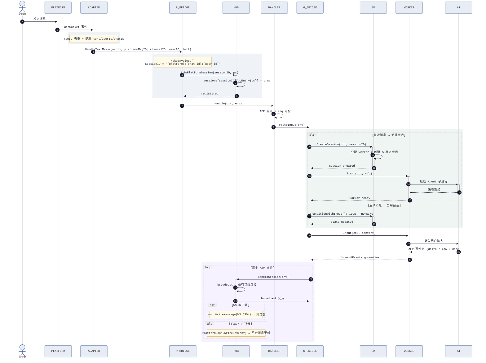
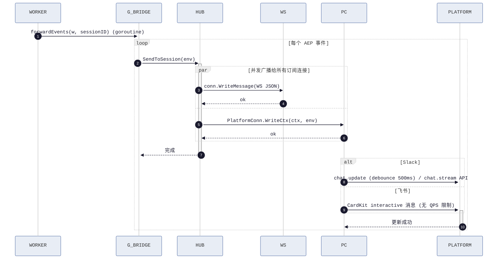

# HotPlex Gateway 平台消息扩展 — 架构图

> 配套文档：[Platform-Messaging-Extension.md](./Platform-Messaging-Extension.md)（完整设计方案）

---

## 1. 整体架构

```
┌──────────────────────────────────────────────────────────────────────────────────────┐
│                               HOTPLEX GATEWAY                                      │
│                                                                                      │
│   ┌─────────────┐    ┌─────────────┐    ┌─────────────────────┐                    │
│   │ WS 客户端   │    │Slack Socket │    │ 飞书 larkws SDK     │                    │
│   │浏览器/SDK   │    │Mode 长连接   │    │ WebSocket 长连接     │                    │
│   └──────┬──────┘    └──────┬──────┘    └──────────┬──────────┘                    │
│          │                  │                      │                                 │
│          │ WS 连接           │ Socket Mode          │ larkws                          │
│          ▼                  ▼                      ▼                                 │
│   ┌─────────────────────────────────────────────────────────────────────────┐     │
│   │                        接 入 层 (Adapter)                                  │     │
│   │  gateway.Conn  │  slack.Adapter  │  feishu.Adapter                        │     │
│   └────────┬───────────┴───────┬───────┴──────────┬──────────────────────────┘     │
│            │                   │                  │                                  │
│            │ JoinSession       │ JoinPlatformSession                              │
│            ▼                   ▼                      ▼                                 │
│   ┌─────────────────────────────────────────────────────────────────────────┐     │
│   │                        Hub (分 发 层)                                     │     │
│   │  sessions[sessionID]: map[*Conn]bool                                    │     │
│   │    ├─ *gateway.Conn   (WS 客户端)                                       │     │
│   │    └─ *pcEntry{pc}    (PlatformConn wrapper) ← 新增                    │     │
│   │  conns: map[*Conn]bool   ← 仅 WS 客户端，PlatformConn 不入此 map         │     │
│   │  broadcast: chan Envelope   ← 背压感知广播                               │     │
│   │                                                                              │     │
│   │  JoinPlatformSession(sessionID, pc)  ← 新增方法 (~20 行)                 │     │
│   │  SendToSession(sessionID, env)  ← 所有连接共享                             │     │
│   └────────────────────────────────────┬──────────────────────────────────────┘     │
│                                        │                                           │
│                                        ▼                                           │
│   ┌─────────────────────────────────────────────────────────────────────────┐     │
│   │                        Handler (逻 辑 层)                                 │     │
│   │  Handle(ctx, env)  ← AEP v1 事件派发，零传输层依赖                       │     │
│   │  ├─ routeInput()   → Bridge.StartSession / TransitionWithInput           │     │
│   │  ├─ handlePing()                                                        │     │
│   │  └─ handleControl()                                                     │     │
│   └────────────────────────────────────┬──────────────────────────────────────┘     │
│                                        │                                           │
│                                        ▼                                           │
│   ┌─────────────────────────────────────────────────────────────────────────┐     │
│   │                          Bridge (编 排 层)                                │     │
│   │                                                                              │     │
│   │  Gateway Bridge (已有)              │  Platform Bridge (新增)            │     │
│   │  ├─ StartSession()                   │  ├─ Handle(ctx, env)                │     │
│   │  ├─ ResumeSession()                 │  │    └─→ Handler.Handle()          │     │
│   │  ├─ forwardEvents(w, sessionID)    │  ├─ JoinSession(pc)                │     │
│   │  │    goroutine 事件转发           │  │    └─→ Hub.JoinPlatformSession() │     │
│   │  └─ worker lifecycle               │  ├─ MakeEnvelope()                  │     │
│   │                                      │  └─ platform 身份验证                │     │
│   └────────────────────────────────────┬──────────────────────────────────────┘     │
│                                        │                                           │
│                                        ▼                                           │
│   ┌─────────────────────────────────────────────────────────────────────────┐     │
│   │                      Session Manager (数 据 层)                            │     │
│   │  5 状态机: Created → Running ↔ Idle → Terminated → Deleted             │     │
│   │  SQLite WAL 持久化 (单写 goroutine 串行写入)                           │     │
│   └────────────────────────────────────┬──────────────────────────────────────┘     │
│                                        │                                           │
│                                        ▼                                           │
│   ┌─────────────────────────────────────────────────────────────────────────┐     │
│   │                      Worker Registry + Adapters (ACPX 未实现)               │     │
│   │  ClaudeCode │ OpenCodeSrv │ ~~ACPX~~ │     │
│   │  (stdio)     │  (HTTP/SSE) │  (—)        │     │
│   └─────────────────────────────────────────────────────────────────────────┘     │
└──────────────────────────────────────────────────────────────────────────────────────┘
                                         │
                                         ▼ AEP over stdio / HTTP / NDJSON
                              ┌───────────────────────────┐
                              │    AI Coding Agent        │
                              │  Claude Code / OpenCode   │
                              └───────────────────────────┘
```

---

## 2. 文件结构

```
cmd/hotplex/main.go        ← ~30行新增: messaging 包初始化 + goroutine 启动

internal/
  gateway/
    hub.go       ← ~20行新增: JoinPlatformSession + pcEntry (唯一改动点)
    conn.go      (WS 连接读写泵)
    handler.go   (AEP 事件派发, 零改动)
    bridge.go    (WS Bridge, 零改动)

  session/
    manager.go   (5 状态机, 零改动)

  worker/               (零改动)
    worker.go    Worker 接口
    registry.go  自注册工厂
    base/        共享生命周期基座
    claudecode/ opencodesrv/ pimon/  (acpx/ — ⚠️ 未实现)

  messaging/           ★ NEW (~650 行, 零核心文件改动)
  ├── platform_conn.go       PlatformConn 接口 (WriteCtx + Close)
  ├── platform_adapter.go    基座类 + AdapterBuilder 自注册工厂
  ├── bridge.go              PlatformBridge 编排逻辑
  ├── slack/
  │   ├── adapter.go         Socket Mode handler (~200 行)
  │   ├── events.go          事件映射
  │   └── stream.go          流式消息 (chat.update debounce)
  └── feishu/
      ├── adapter.go         larkws handler (~200 行)
      ├── events.go          事件映射
      └── card.go            CardKit 流式消息

  security/  config/  admin/   (零改动)

pkg/
  events/events.go   (Envelope / Event, 零改动)
  aep/aep.go         (AEP v1 编解码, 零改动)
```

---

## 3. 消息流序列图

> 配色主题: neutral（浅色背景 + 深色文字）

### 3.1 入向流程（平台 → Worker → 平台广播）



### 3.2 出向流程（并发广播）



---

## 4. 核心接口关系

```
PlatformConn 接口 (messaging/platform_conn.go)
┌──────────────────────────────────────────────┐
│  WriteCtx(ctx, env) error                   │  ← Hub.SendToSession 回调
│  Close() error                              │  ← Hub 关闭时调用
└──────────────────────────────────────────────┘
                │ 实现
    ┌───────────┼──────────────┐
    ▼           ▼              ▼
┌────────┐ ┌──────────┐ ┌──────────┐
│Conn    │ │Slack     │ │Feishu    │
│(WS 读写)│ │Adapter   │ │Adapter   │
│        │ │→chat.upd │ │→CardKit  │
└────────┘ └──────────┘ └──────────┘
    │           │              │
    │JoinSession              │
    │         JoinPlatformSession(sessionID, pc)
    ▼
┌──────────────────────────────────────────────────────────┐
│  Hub (分发层)                                             │
│  sessions[sessionID]: map[*Conn]bool                    │
│    ├─ *gateway.Conn  (WS 客户端)                        │
│    └─ *pcEntry{pc}   (PlatformConn wrapper) ← 新增     │
│                                                          │
│  pcEntry 实现 *gateway.Conn 接口：                       │
│    WriteCtx → pc.WriteCtx                               │
│    Close    → pc.Close                                  │
└──────────────────────────────────────────────────────────┘
```

---

## 5. 自注册工厂模式

```
┌─────────────────────────────────────────────────────────────────┐
│                    Worker Registry        Platform Registry       │
│                    (已有)                 (同构设计, ★NEW)        │
├─────────────────────────────────────────────────────────────────┤
│  文件      internal/worker/worker.go    internal/messaging/     │
│                 ↗                         platform_adapter.go   │
│  接口      type Worker interface{}       type PlatformAdapter    │
│                 ↗                         Interface interface{}    │
│  Builder   type Builder func(log)       type AdapterBuilder    │
│                 ↗                         func(log) Platform...  │
│  Registry  var registry =                 var registry =         │
│            map[WorkerType]Builder        map[PlatformType]      │
│                 ↗                         AdapterBuilder         │
│  Register  func Register(t, b)           func Register(t, b)    │
│  New       func New(t, log) Worker       func New(t, log)       │
├─────────────────────────────────────────────────────────────────┤
│  init()   claudecode/ → Register()      slack/ → Register()    │
│           feishu/ → Register()   │
│           ...                            ...                    │
└─────────────────────────────────────────────────────────────────┘
```

---

## 6. 平台特性对比

|                | WS 客户端     | Slack 适配器          | 飞书适配器        |
|----------------|---------------|----------------------|------------------|
| 连接建立        | WS 握手       | Socket Mode SDK       | larkws SDK        |
| 认证           | API Key (网关层)   | App Token (SDK 层)    | App Token + 刷新  |
| Session ID     | client UUID   | `slack:{team}:{ch}:{user}` | `feishu:{chat}:{user}` |
| 消息去重       | WS 无重复     | ClientMsgID dedup     | message_id dedup  |
| 流式输出       | WS 实时推送    | chat.update debounce  | CardKit (无 QPS 限制) |
| 心跳/重连      | WS ping/pong  | SDK 自动               | SDK 自动          |
| Hub 注册       | JoinSession()  | JoinPlatformSession() | JoinPlatformSession() |
| 出向实现       | WriteMessage  | WriteCtx → chat.update | WriteCtx → CardKit |

---

## 7. 耦合关系

### 7.1 改动清单

| 现有文件           | 改动量     | 侵入性   | 说明                                     |
|-------------------|-----------|---------|----------------------------------------|
| `hub.go`          | ~20 行新增 | 低-additive | JoinPlatformSession + pcEntry wrapper |
| `main.go`         | ~30 行新增 | 轻侵入   | messaging 包初始化，不改 GatewayDeps     |
| `handler.go`      | 0 行      | 零改动  | Handle() 纯函数，不区分调用来源           |
| `bridge.go` 现有  | 0 行      | 零改动  | 新建 `messaging/bridge.go`              |
| `session/manager`  | 0 行      | 零改动  | 不感知输入来源                           |
| `worker/worker.go` | 0 行      | 零改动  | 消息经 Handler 路由到现有 Worker         |
| `pkg/events/`      | 0 行      | 零改动  | 所有字段通用                             |
| `gateway/conn.go` | 0 行      | 零改动  | Conn.WriteCtx/Close 与 PlatformConn 一致 |
| `security/auth.go` | 0 行      | 零改动  | Platform 认证走平台 SDK                  |

### 7.2 潜在风险

| 风险                   | 影响 | 缓解方案                                          |
|----------------------|------|-------------------------------------------------|
| pcEntry 存为 `*Conn` 类型 | 低   | 考虑将 `h.sessions` key 显式改为接口             |
| Platform BotID 为空   | 中   | messaging 包注入 sentinel botID (`"slack"`)      |
| OwnerID 由 Adapter 预填 | 中   | 从 Authenticator 获取 signed platform token        |

### 7.3 依赖方向

```
新 messaging/ 包 ──引用──▶ 现有包 (单向依赖)
  platform_conn.go  → pkg/events
  bridge.go          → internal/gateway (Hub, Handler)
                      internal/security (Authenticator)
                      pkg/aep, pkg/events
  slack/adapter.go  → github.com/slack-go/slack
  feishu/adapter.go → github.com/larksuite/oapi-sdk-go/v2

现有包 ──零依赖──▶ messaging/ 包
cmd/hotplex/main.go   → messaging (初始化, 唯一反向引用)
其他所有文件对 messaging/ 完全无感知
```

**结论**: 核心承诺「零核心文件改动」成立。唯一改动的现有文件是 `hub.go`（~20 行 additive），其余均为新建文件。
