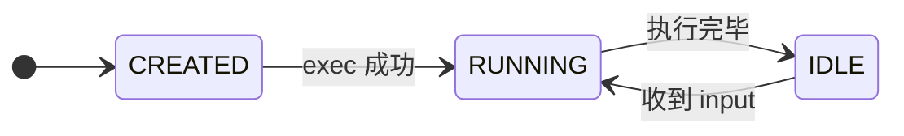

---

---

# Worker Gateway Design

> 统一接入层，屏蔽不同 AI Coding Agent 的运行协议、通信方式、生命周期管理差异。

---

## 1. 背景与目标

构建一个 **Agent Gateway（统一接入层）**，用于屏蔽不同 AI Coding Agent（Claude Code、OpenCode Server）在运行协议、通信方式、生命周期管理上的差异。

### 核心目标

- 统一的 **WebSocket 全双工通信协议**（[[architecture/AEP-v1-Protocol]]）
- 统一的 **Session 生命周期管理**
- 屏蔽底层 Agent 的 CLI / stdio / server 差异、streaming / 非 streaming 差异
- 不侵入 agent 内部能力（保持黑盒）

---

## 2. 范围边界

本文档覆盖 HotPlex v1.0 中的 **Worker 抽象封装 + WS Gateway** 子系统。v1.0 的其他子系统（安全、可观测性、调度、持久化等）将在独立设计文档中定义。

---

## 3. 总体架构

```
Client (Web / IDE / CLI)
        │
  WebSocket API (AEP v1)
        │
  WS Gateway Layer
        │
  Session Manager (同进程)
        │
  Worker Adapter Layer (同进程)
        │
  Claude Code / OpenCode
```

Gateway 与 Worker Adapter 在同一进程内，Session Manager 通过 Go 接口调用 Worker Adapter。

---

## 4. 核心设计原则

### 4.1 Session 一等公民

- Session 独立于连接存在
- 支持 reconnect / resume / 多客户端 attach（未来）

### 4.2 控制面 / 数据面分离

| 类型           | 说明                    |
| -------------- | ----------------------- |
| Session 状态   | 内存 + 持久化（SQLite） |
| Agent 输出     | 不存储（流式透传）      |
| Agent 内部状态 | Worker 自身管理         |

### 4.3 协议最小化

Gateway 只保证 **消息传输 + 生命周期控制**，不保证语义一致或工具标准化。

### 4.4 Tool 执行模型 = Autonomous

Worker 自行决定和执行 tool 调用。`tool_call` / `tool_result` 事件 **仅通知 Client**（用于 UI 展示），Client 不参与 tool 执行流程。

---

## 5. Session 模型

> 状态集合与 [[architecture/AEP-v1-Protocol]] §3.9 保持一致。AEP 为 single source of truth。

### 5.1 Session ID 映射机制

> **客户端管理的 Session ID**：客户端通过 `init.session_id` 上送 `client_session_id`，服务端用 UUIDv5 做一致性映射，确保相同 `(owner_id, worker_type, client_session_id)` 永远映射为同一服务端 session。

#### 5.1.1 UUIDv5 映射算法

```go
// internal/session/key.go
var hotplexNamespace = uuid.MustParse("urn:uuid:6ba7b810-9dad-11d1-80b4-00c04fd430c8")

func DeriveSessionKey(ownerID string, wt worker.WorkerType, clientSessionID string) string {
    name := ownerID + "|" + string(wt) + "|" + clientSessionID
    id := uuid.NewHash(hotplexNamespace, name)
    return id.String()
}
```

#### 5.1.2 init 流程

```
Client init{session_id: "my-chat-001"}
  → DeriveSessionKey(ownerID="user_001", wt="claude_code", clientSessionID="my-chat-001")
  → UUIDv5: "550e8400-e29b-41d4-a716-446655440000"
  → sm.GetOrCreate("550e8400-e29b-41d4-a716-446655440000")
      ├─ 存在 → 返回现有 session（idempotent）
      └─ 不存在 → 创建新 session
```

#### 5.1.3 WorkerSessionIDHandler 接口

> 某些 Worker（OpenCode Server）内部使用独立的 session ID 系统。Gateway 通过 `WorkerSessionIDHandler` 接口获取该内部 ID 并持久化到 SQLite `sessions.worker_session_id` 字段。

```go
// internal/worker/worker.go
type WorkerSessionIDHandler interface {
    SetWorkerSessionID(id string)
    GetWorkerSessionID() string
}
```

**实现者**：
- **OpenCode Server**：使用 HTTP 连接中的 session ID

**持久化时机**：`bridge.forwardEvents()` 收到第一个 worker 事件时，调用 `persistWorkerSessionID()` 更新 DB。

### 5.2 状态机

#### 状态总览

```
5 个状态，3 类路径：

  活跃态（内部循环）          汇聚态                终态
  ┌──────────────────┐        ┌──────────┐        ┌─────────┐
  │ CREATED          │        │          │        │         │
  │   ↓ exec         │  异常  │          │  GC    │         │
  │ RUNNING ←→ IDLE  │ ────→  │TERMINATED│ ────→  │ DELETED │
  │                  │        │          │        │         │
  └──────────────────┘        └────┬─────┘        └─────────┘
           ↑                       │
           └──── resume ───────────┘

  管理快捷路径：RUNNING / IDLE ──admin kill──→ DELETED（绕过 TERMINATED）
```

#### Mermaid 图（Happy Path）



> **其余路径**：所有活跃态均可因异常→ `TERMINATED`；`TERMINATED` 可 resume 回 `RUNNING`；Admin 可直接将活跃态→ `DELETED`。详见下方转换表。

#### 完整状态转换表

| 从                 | 触发                                 | 到           | 类别     | 事件                                               |
| ------------------ | ------------------------------------ | ------------ | -------- | -------------------------------------------------- |
| `CREATED`          | fork+exec 成功                       | `RUNNING`    | 正常     | `state(running)`                                   |
| `CREATED`          | 启动失败（binary 不存在 / 权限不足） | `TERMINATED` | 异常     | `error(WORKER_START_FAILED)` + `state(terminated)` |
| `RUNNING`          | 执行完毕，等待输入                   | `IDLE`       | 正常     | `state(idle)`                                      |
| `IDLE`             | 收到新 input                         | `RUNNING`    | 正常     | `state(running)`                                   |
| `RUNNING`          | crash / execution_timeout / kill     | `TERMINATED` | 异常     | `error(*)` + `state(terminated)`                   |
| `IDLE`             | idle_timeout / GC / kill             | `TERMINATED` | 异常     | `state(terminated)`                                |
| `TERMINATED`       | resume（重新启动 runtime）           | `RUNNING`    | 恢复     | `state(running)`                                   |
| `TERMINATED`       | GC / 生命周期结束                    | `DELETED`    | 终态     | —（控制面）                                        |
| `RUNNING` / `IDLE` | admin force kill                     | `DELETED`    | 管理操作 | `error(PROCESS_SIGKILL)` + WS close                |

> **幂等性**：对已处于 `TERMINATED` 状态的 session 重复执行 terminate → no-op。
> **DELETED 快捷路径**：Admin API 可绕过 `TERMINATED` 直接将 `RUNNING` / `IDLE` session 标记为 `DELETED`，同时 SIGKILL runtime。

### 5.2 状态定义

| 状态         | 含义                       | AEP event           |
| ------------ | -------------------------- | ------------------- |
| `CREATED`    | 已创建，未启动 runtime     | `state(created)`    |
| `RUNNING`    | 正在执行                   | `state(running)`    |
| `IDLE`       | 等待输入                   | `state(idle)`       |
| `TERMINATED` | 已终止                     | `state(terminated)` |
| `DELETED`    | 已清理（控制面，不走 AEP） | —                   |

Worker 内部处于 tool 执行阶段时，Gateway 不区分 — 状态仍为 `RUNNING`。Client 通过 `tool_call` / `tool_result` 事件推断 Worker 阶段，无需额外状态。

### 5.3 生命周期规则

- `sessionID` 全局唯一
- Session 可脱离 WebSocket 存在
- Session 可被 resume（语义恢复），runtime 不保证可恢复
- 任何状态均可异常转为 `TERMINATED`（crash / timeout / kill / 僵尸进程超时）
- **僵死防范 (Zombie IO Polling)**: 若进程状态为 `RUNNING` 且配合 `HealthChecker.LastIO()` 检测到超过超时阈值（如 5 分钟）没有吐出任何实质 IO (如 `.delta`)，Gateway 必须强制中止该幽灵进程，以防长期挂起堵塞队列并抛出 `EXECUTION_TIMEOUT` 错误码或触发重置。
- Admin API 可将任何活跃状态直接转为 `DELETED`（强制清理）

> [!WARNING]
> **架构局限（Split-Brain Persistence）**：在当前的 Autonomous 模型下，控制面数据（如 session 状态）由网关写入全局持久化的 SQLite（如 EventStore 插件）持有；而**所有的状态面上下文数据（对话历史记录等）由被挂载节点的原生 CLI 服务闭环独立持有（如本地的 `.jsonl` 或底层 SQLite DB）**。
> **这意味着**：如果发生容器跨机调度漂移、Load Balancer 轮询分发异常，尝试发起 `--resume` 时将会因为“读取不到挂载卷的对应数据”而发生**裂脑故障**。在系统全面接入共享文件系统（如 NAS/EBS）前，当前设计必须强制要求网关层进行 Client IP 或 Session ID 纬度的**节点亲和绑定 (Sticky Sessions)**。

### 5.4 竞态防护

| 竞态场景                                                                    | 防护策略                                                                                       |
| --------------------------------------------------------------------------- | ---------------------------------------------------------------------------------------------- |
| **Resume TOCTOU** — Client 发 `init(session_id)` 同时 Worker crash          | Gateway 在 resume 时加读锁检查 session 存活，init 处理和 Worker 状态检测在**同一临界区**内完成 |
| **done 与 input 竞态** — Client 发 input 时 Worker 刚好发 `done`            | input 处理和 state 转换在**同一互斥锁**内完成，确保状态判断的一致性                            |
| **Heartbeat 与 Reconnect 并存** — 旧连接 heartbeat 超时同时新连接 reconnect | Gateway 按 `session_id` 去重连接，只保留最新连接，旧连接自动降级                               |
| **并发 input** — 多个 Client 同时向同一 session 发 input                    | `SESSION_BUSY` 硬拒绝（非 queue），避免 queue 溢出和顺序保证的复杂性                           |

---

## 6. 数据模型（SQLite）

### 6.1 sessions 表

```sql
CREATE TABLE sessions (
    id TEXT PRIMARY KEY,
    worker_session_id TEXT,
    worker_type TEXT NOT NULL,
    state TEXT NOT NULL,
    created_at DATETIME NOT NULL,
    updated_at DATETIME NOT NULL,
    expires_at DATETIME,
    is_active BOOLEAN NOT NULL DEFAULT 0,
    context_json TEXT
);
```

### 6.2 约束

- `id`：UUID
- `state`：受限枚举（`created`, `running`, `idle`, `terminated`, `deleted`）
- `is_active`：仅用于标记是否存在 runtime
- SQLite 使用 **WAL mode**（Write-Ahead Logging），允许并发读取、串行写入
- 写入操作通过**单写 goroutine** 串行化，避免 SQLite 的写锁竞争

> **设计决策**：Gateway 仅持久化 session 元数据（控制面）。Worker 自行负责对话历史、上下文窗口等业务数据的持久化（如 Claude Code 的 `~/.claude/projects/` jsonl 文件）。Gateway 不做 event log，不负责 replay。

### 6.3 GC 策略

| 资源    | 触发条件                                        | 动作                         |
| ------- | ----------------------------------------------- | ---------------------------- |
| Session | `IDLE` 超过 `idle_timeout`（默认 60min）        | → `TERMINATED`，清理 runtime |
| Session | 总存活超过 `max_lifetime`（默认 24h）           | → `TERMINATED`               |
| Session | `TERMINATED` 超过 `retention_period`（默认 7d） | → `DELETED`（删除 DB 记录）  |

GC 扫描间隔：60s，后台 goroutine 定期执行。

---

## 7. Worker 抽象

### 7.1 定义

> Worker = Agent Runtime Adapter

Worker **自行执行 tool**（Autonomous 模式）。`tool_call` / `tool_result` 仅为输出通知，不要求 Client 参与。

### 7.2 Worker 能力

- 创建 session runtime
- 发送消息（stdin）
- 接收消息流（stdout）
- 终止运行
- 声明能力（Capabilities）

### 7.3 SessionConn 接口

核心接口：

```go
type SessionConn interface {
    Send(ctx context.Context, msg *Message) error
    Recv() <-chan *Event
    Close() error
}
```

可选能力接口（Worker 按需实现）：

```go
type HealthChecker interface {
    IsAlive() bool
    LastIO() time.Time // 用于判定并清退假活的僵尸进程 (Zombie IO Polling)
}

type GracefulShutdown interface {
    Drain(timeout time.Duration) error
}

type Capable interface {
    Capabilities() WorkerCapabilities
}

type WorkerCapabilities struct {
    Streaming       bool     // 支持 message.delta 流式输出
    Resume          bool     // 支持 session resume（如 Claude Code --resume）
    MaxTurns        int      // 单 session 最大轮次（0 = 无限）
    MaxContextTokens int     // 最大上下文 token 数
    Tools           []string // 支持的工具列表
    Modalities      []string // 支持的模态（text, code, image）
}
```

能力声明遵循 A2A Agent Card 模式 — init 时交换，运行时不再变更。

> **参考**: MCP (Model Context Protocol) 使用相同的 `initialize` → `initialized` 能力握手模式。OpenAI Realtime API 通过 `session.update` 支持运行时动态重配置。HotPlex v1.0 选择 init-only（简化），v1.1 考虑引入 `config.update` 支持动态调整。

### 7.4 Worker 分类

按 **Transport × Protocol × Lifecycle** 三维分类：

```
Transport:   stdio | http(sse)
Protocol:    stream-json | ndjson | raw-stdout | json-lines
Lifecycle:   persistent | ephemeral | managed
```

| Worker              | Transport  | Protocol    | Lifecycle  | 说明                                        |
| ------------------- | ---------- | ----------- | ---------- | ------------------------------------------- |
| Claude Code         | stdio      | stream-json | persistent | turn 间进程不退出，热复用                   |
| **OpenCode Server** | HTTP + SSE | SSE/JSON    | managed    | `opencode serve`，单进程多 session          |
| ACPX                | —          | —           | —          | ⚠️ **未实现**（`internal/worker/acpx/` 为空目录） |

> **Hot-Multiplexing**：persistent Worker 在 turn 结束后**不退出进程**，保持 `idle` 状态等待下一轮 stdin 输入，实现零冷启动。ephemeral Worker 每次执行完毕退出。managed Worker 由外部进程管理生命周期。

新增 Worker 只需填三维属性：
- **Transport** 决定连接方式（stdio pipe / HTTP）
- **Protocol** 决定事件解析策略
- **Lifecycle** 决定复用/销毁策略

### 7.5 插件化注册机制 (Plugin Registry)

为了彻底贯彻 SOLID 设计规范的 **OCP（开闭原则）**，网关与 Worker 引擎之间的装配使用了依赖反转与底层包匿名导入（Plugin Registration）的架构。

1. **中央集控**：`internal/worker/adapter.go` 维护线程安全的 `Registry` 字典，对外暴露无状态的门面函数 `worker.NewWorker(wt)`。
2. **包级自组装**：各 Worker （如 `claudecode`, `opencodeserver`, `pi` 等）的独立子包维护私有的 `init()` 回调。子包对核心模块有所有权占领意识。
3. **空导入编排**：系统执行链唯一的硬接驳点位于 `cmd/gateway/main.go`，通过 `import _ "hotplex/internal/worker/pi"` 唤醒所有合法挂载项。
4. **安全断言 (Fail Fast)**：请求不合法的或者未经代码编译期验证挂载的引擎，网关将在会话初期强阻断。

---

## 8. Worker 集成规格

### 8.1 Claude Code（stream-json / stdio / persistent）

#### 概述

| 维度      | 设计                                      |
| --------- | ----------------------------------------- |
| Transport | stdio（stdin/stdout pipe）                |
| Protocol  | stream-json（NDJSON，每行一个 JSON 对象） |
| 进程模型  | 持久进程，多轮复用（Hot-Multiplexing）    |
| CLI 源码  | `~/claude-code/src`                       |

**启动命令**：
```bash
claude --print \
  --output-format stream-json \
  --input-format stream-json \
  --session-id <uuid>
```

#### 核心能力

| 能力         | 说明                                                                |
| ------------ | ------------------------------------------------------------------- |
| Streaming    | token-level 实时流，通过 `stream_event` 发送 thinking / text delta  |
| Tool 执行    | `tool_use` / `tool_progress` 通知，Worker 自主执行                  |
| 权限控制     | `control_request` subtype=`can_use_tool`，转发 Client 或按策略决策  |
| Session 恢复 | `--resume <id>` 恢复历史会话，支持 `session_*` / `cse_*` 双格式兼容 |
| 优雅关闭     | SIGTERM → 5s failsafe → cleanup → SIGKILL                           |
| NDJSON 安全  | **必须**转义 U+2028 / U+2029（JS 行分隔符）                         |
| MCP 配置     | `--mcp-config <json>` / `--strict-mcp-config` 运行时注入            |
| 环境隔离     | 必须移除 `CLAUDECODE=`，注入 `ANTHROPIC_API_KEY`                    |

#### 关键 SDK 消息类型

| type                    | 说明                                 | AEP 映射             |
| ----------------------- | ------------------------------------ | -------------------- |
| `stream_event`          | 流式 delta（thinking/text/tool）     | `message.delta`      |
| `assistant`             | 完整助手消息块                       | `message`            |
| `tool_progress`         | 工具执行结果                         | `tool_result`        |
| `result`                | turn 结束（success/error，含 stats） | `done`               |
| `control_request`       | 控制请求（权限/中断/MCP）            | `permission_request` |
| `session_state_changed` | 会话状态变更                         | `state`              |

#### Session 管理

- **存储**：`~/.claude/projects/<workspace-key>/<session-id>.jsonl`
- **Gateway 追踪**：Marker Store（`~/.hotplex/sessions/<id>.lock`）
- **Resume**：Marker + session 文件都存在 → `--resume` 模式

#### 进程生命周期

```
启动 → ready → busy（执行 turn） → ready → ... → dead
```

Hot-Multiplexing 优势：消除冷启动（MCP server 只初始化一次），上下文持续累积。需配合 `max_turns` 或内存水印防止状态污染。

> **详细规格**：[`Worker-ClaudeCode-Spec.md`](../specs/Worker-ClaudeCode-Spec.md) — 完整 CLI 参数表、SDK 消息定义、控制协议 11 种子类型、NDJSON Go 序列化实现、源码关键路径、实现优先级（P0/P1/P2）。

---

### 8.2 OpenCode Server

OpenCode 通过 `opencode serve` 命令提供 HTTP + SSE 协议的 Server 模式，由单一进程服务所有 session。

> **注意**：OpenCode CLI 模式（`opencode run --format json`）已在 v1.0 中废弃，仅保留 Server 模式。

---

#### 8.2.1 OpenCode Server（`opencode serve`）

##### 架构设计

**设计目标**：单一 `opencode serve` 进程服务所有 session，进程生命周期由 HotPlex SessionPool 托管。

```
HotPlex SessionPool
     │
     ├── 进程管理器（Process Manager）
     │    │
     │    ├── spawn: opencode serve --port {dynamic_port} --password {token}
     │    ├── 健康检查: GET /global/health
     │    └── 崩溃恢复: 自动重启进程
     │
     └── HTTPTransport（连接池）
          │
          ├── Session A ←── SSE ──→ HTTPTransport
          ├── Session B ←── SSE ──→ HTTPTransport
          └── Session C ←── SSE ──→ HTTPTransport
```

**核心设计原则**：
1. **进程托管**：HotPlex 完全掌控 serve 进程生命周期（spawn/health/restart/cleanup）
2. **单一进程**：所有 session 共享同一个 serve 进程（资源效率）
3. **动态端口**：避免端口冲突，支持多 HotPlex 实例
4. **故障隔离**：serve 崩溃时自动重启，session 状态保留在 opencode SQLite（可恢复）

##### Transport × Protocol × Lifecycle

| 维度          | 设计                                          |
| ------------- | --------------------------------------------- |
| **Transport** | HTTP（REST API） + SSE（事件流）              |
| **Protocol**  | SSE/JSON（Server-Sent Events，每行一个 JSON） |
| **Lifecycle** | **Managed**（HotPlex 托管进程）               |
| **进程模型**  | 1 个 `opencode serve` 进程服务所有 session    |

##### 进程管理器设计

```go
// OpenCodeServerManager 管理单一 opencode serve 进程
type OpenCodeServerManager struct {
    mu        sync.RWMutex
    cmd       *exec.Cmd
    transport *HTTPTransport
    port      int
    password  string

    // 进程状态
    isAlive   bool
    startTime time.Time

    // 健康检查
    healthCheckInterval time.Duration
    healthCheckTimeout  time.Duration
}

// Start 启动 opencode serve 进程
func (m *OpenCodeServerManager) Start(ctx context.Context) error {
    m.mu.Lock()
    defer m.mu.Unlock()

    // 1. 分配动态端口（或使用配置的固定端口）
    if m.port == 0 {
        m.port = allocateDynamicPort() // 从可用端口池分配
    }

    // 2. 生成认证 token（或使用配置的密码）
    if m.password == "" {
        m.password = generateSecureToken()
    }

    // 3. Spawn 进程
    cmd := exec.CommandContext(ctx, "opencode", "serve",
        "--port", strconv.Itoa(m.port),
        "--password", m.password)
    cmd.SysProcAttr = &syscall.SysProcAttr{Setpgid: true}

    if err := cmd.Start(); err != nil {
        return fmt.Errorf("spawn opencode serve: %w", err)
    }

    m.cmd = cmd
    m.startTime = time.Now()

    // 4. 等待进程就绪（health check loop）
    if err := m.waitForReady(ctx); err != nil {
        _ = syscall.Kill(-cmd.Process.Pid, syscall.SIGKILL)
        return fmt.Errorf("opencode serve not ready: %w", err)
    }

    // 5. 初始化 HTTPTransport
    m.transport = NewHTTPTransport(HTTPTransportConfig{
        Endpoint: fmt.Sprintf("http://127.0.0.1:%d", m.port),
        Password: m.password,
        Timeout:  30 * time.Second,
    })

    // 6. 启动后台健康检查
    go m.healthCheckLoop(ctx)

    m.isAlive = true
    return nil
}

// waitForReady 等待 serve 进程就绪
func (m *OpenCodeServerManager) waitForReady(ctx context.Context) error {
    deadline := time.Now().Add(10 * time.Second)
    client := &http.Client{Timeout: 2 * time.Second}

    for time.Now().Before(deadline) {
        req, _ := http.NewRequestWithContext(ctx, http.MethodGet,
            fmt.Sprintf("http://127.0.0.1:%d/global/health", m.port), nil)
        req.SetBasicAuth("opencode", m.password)

        resp, err := client.Do(req)
        if err == nil {
            resp.Body.Close()
            if resp.StatusCode == http.StatusOK {
                return nil
            }
        }

        time.Sleep(200 * time.Millisecond)
    }

    return fmt.Errorf("opencode serve health check timeout")
}

// healthCheckLoop 定期检查进程健康
func (m *OpenCodeServerManager) healthCheckLoop(ctx context.Context) {
    ticker := time.NewTicker(m.healthCheckInterval)
    defer ticker.Stop()

    for {
        select {
        case <-ctx.Done():
            return
        case <-ticker.C:
            if !m.checkHealth(ctx) {
                m.restart(ctx)
            }
        }
    }
}

// IsAlive 检查进程是否存活
func (m *OpenCodeServerManager) IsAlive() bool {
    m.mu.RLock()
    defer m.mu.RUnlock()
    return m.isAlive && m.cmd != nil && m.cmd.Process != nil && m.cmd.ProcessState == nil
}

// restart 重启进程（崩溃恢复）
func (m *OpenCodeServerManager) restart(ctx context.Context) {
    m.mu.Lock()
    defer m.mu.Unlock()

    m.logger.Warn("OpenCode serve process crashed, restarting...")

    // 1. 清理旧进程
    if m.cmd != nil && m.cmd.Process != nil {
        _ = syscall.Kill(-m.cmd.Process.Pid, syscall.SIGKILL)
    }

    // 2. 重启进程
    if err := m.Start(ctx); err != nil {
        m.logger.Error("Failed to restart opencode serve", "error", err)
        m.isAlive = false
    }
}
```

##### HTTPSessionStarter 集成

```go
// HTTPSessionStarter 创建 HTTP 模式的 session
type HTTPSessionStarter struct {
    manager    *OpenCodeServerManager  // 进程管理器
    logger     *slog.Logger
}

func (s *HTTPSessionStarter) StartSession(
    ctx context.Context,
    sessionID string,
    cfg SessionConfig,
    prompt string,
    cb Callback,
) (*Session, error) {
    // 1. 检查 serve 进程是否存活
    if !s.manager.IsAlive() {
        if err := s.manager.Start(ctx); err != nil {
            return nil, fmt.Errorf("start opencode serve: %w", err)
        }
    }

    // 2. 通过 HTTP API 创建 session
    transport := s.manager.GetTransport()
    ocSessionID, err := transport.CreateSession(ctx, "HotPlex Session")
    if err != nil {
        return nil, fmt.Errorf("create opencode session: %w", err)
    }

    // 3. 构建消息（注入 system prompt）
    msg, err := buildOpenCodeMessage(prompt, cfg.SystemPrompt)
    if err != nil {
        return nil, fmt.Errorf("build message: %w", err)
    }

    // 4. 发送消息（异步）
    if err := transport.Send(ctx, ocSessionID, msg); err != nil {
        return nil, fmt.Errorf("send message: %w", err)
    }

    // 5. 创建 Session 对象
    sess := &Session{
        ID:         sessionID,
        ocSessionID: ocSessionID,
        io:         NewHTTPSessionIO(transport, ocSessionID, cb),
        state:      StateRunning,
        createdAt:  time.Now(),
    }

    // 6. 启动事件读取 goroutine
    go sess.io.StartReading(ctx)

    return sess, nil
}
```

##### HTTP API 设计

| Endpoint                                  | Method | 用途           | 说明                             |
| ----------------------------------------- | ------ | -------------- | -------------------------------- |
| `GET /global/health`                      | GET    | 健康检查       | 返回 `{"healthy": true}`         |
| `GET /event`                              | GET    | SSE 全局事件流 | 订阅所有 session 事件（fan-out） |
| `POST /session`                           | POST   | 创建 session   | 返回 `{id: "ses_xxx"}`           |
| `POST /session/{id}/prompt_async`         | POST   | 异步发送消息   | 返回 204（streaming via SSE）    |
| `DELETE /session/{id}`                    | DELETE | 删除 session   | 清理 session 资源                |
| `POST /session/{id}/permissions/{permID}` | POST   | 权限响应       | 响应权限请求                     |

**认证**：Basic Auth（`opencode:$PASSWORD`），密码由进程管理器生成或配置注入

**工作目录传递**：`x-opencode-directory` HTTP header（每个请求携带 workDir）

##### SSE Event Types

| SSE Event              | 说明                                | AEP 映射                                      | Turn-end        |
| ---------------------- | ----------------------------------- | --------------------------------------------- | --------------- |
| `message.part.updated` | 消息片段更新（text/tool/reasoning） | `message.delta` / `tool_call` / `tool_result` | ❌               |
| `message.updated`      | 完整消息更新（含 token 统计）       | `message` + `done.stats`（per-step）          | ❌ 中间结果      |
| `session.status`       | 会话状态变更（busy/idle/retry）     | `state`                                       | ✅ `status=idle` |
| `session.idle`         | 会话空闲（turn 结束）               | `done`                                        | ✅               |
| `session.error`        | 会话错误                            | `error`                                       | ✅               |
| `permission.updated`   | 权限请求                            | `permission_request`                          | ❌               |
| `server.heartbeat`     | 服务器心跳（每 10s）                | —（内部监控）                                 | ❌               |

**Turn-end 检测逻辑**：

```go
func (p *OpenCodeServerWorker) DetectTurnEnd(e *WorkerEvent) bool {
    if e == nil { return false }
    if e.Type == EventTypeError { return true }
    if e.Type != EventTypeResult { return false }
    // 只有 session.idle 和 session.status(idle) 标志 turn 完成
    return e.RawType == OCEventSessionIdle || e.RawType == OCEventSessionStatus
}
```

##### Session 持久化

- **存储位置**：`~/.local/share/opencode/`（SQLite）
- **共享机制**：CLI 和 Server 模式共享同一 DB
- **HotPlex 角色**：无状态管道，不持久化 event log

##### 关键特性

| 维度         | OpenCode Server                       |
| ------------ | ------------------------------------- |
| 进程模型     | 1 个共享进程                          |
| 进程管理     | OpenCodeServerManager 托管            |
| Transport    | HTTP + SSE                            |
| 故障隔离     | ⚠️ serve 崩溃影响全部 session          |
| Session 恢复 | serve 重启 → session 可恢复（SQLite） |
| 内存效率     | ~100MB 固定                           |

##### 设计权衡

**优势**：
- 资源效率高（单进程共享）
- Session 持久化在 SQLite（serve 重启后可恢复）
- 动态端口避免冲突（多实例部署友好）

**风险**：
- 单点故障（serve 崩溃 → 所有 session 中断）
- 缓解：进程管理器自动重启 + SQLite 恢复

**适用场景**：
- 边缘网关（多 HotPlex 实例共享一个 serve）
- 内存受限环境
- 企业集中管控（统一日志收集）

---

## 9. 消息协议

> 已统一到 [[architecture/AEP-v1-Protocol]]。所有 WebSocket 通信使用 AEP v1 Envelope，覆盖双向。

Client → Server event kinds：`init`、`input`、`control`、`ping`

Server → Client event kinds：`init_ack`、`message.delta`、`message`、`tool_call`、`tool_result`、`state`、`error`、`done`、`pong`

详见 [[architecture/AEP-v1-Protocol]]。

---

## 10. Session 管理功能

| 操作                | 方向 | 说明                                                                  |
| ------------------- | ---- | --------------------------------------------------------------------- |
| **Create / Resume** | C→S  | `init` 中 `session_id` 存在则 resume，否则创建新 session              |
| **Send**            | C→S  | 通过 `input` event 发送，状态为 `running` 时拒绝（`SESSION_BUSY`）    |
| **Terminate**       | C→S  | `control.terminate`，停止 runtime，状态 → `terminated`                |
| **Delete**          | C→S  | `control.delete`，删除 DB 记录 + 清理 runtime                         |
| **Reconnect**       | S→C  | `control.reconnect`，服务器要求客户端重连（`priority: "control"`）    |
| **Session Invalid** | S→C  | `control.session_invalid`，通知 Session 已失效                        |
| **Throttle**        | S→C  | `control.throttle`，要求客户端降低请求频率                            |
| **List / Query**    | —    | Admin API（非 AEP 通道）                                              |
| **Timeout**         | —    | idle timeout / max lifetime，后台 GC 扫描 `expires_at` 自动 terminate |

> **控制流设计**：AEP 协议统一管理 session 生命周期（创建/恢复/终止/删除），并支持服务器主动控制（重连/失效通知/降级）。详见 [[architecture/AEP-v1-Protocol]] §3.4。

---

## 11. WebSocket 生命周期

### 11.1 连接流程（Handshake）

```
Client                                    Gateway
  |--- init (version, worker_type, -------->|
  |    session_id?, config?,                |
  |    client_caps)                         |
  |                                        |
  |<--- init_ack (session_id, state, ------|
  |     server_caps)                         |
  |                                        |
  |    (握手失败 - worker_type 未知)         |
  |<--- error (PROTOCOL_ERROR) + close ----|
  |                                        |
  |    (握手失败 - version 不兼容)          |
  |<--- error (VERSION_MISMATCH) + close --|
  |                                        |
  |    (握手失败 - 资源耗尽)                |
  |<--- error (CAPACITY_EXCEEDED) + close -|
```

Handshake 包含：
- **协议版本协商**：`version` 字段。当前仅支持 `aep/v1`，未来版本不兼容时返回 `VERSION_MISMATCH` + 支持的最高版本号
- **能力交换**：`client_caps` / `server_caps`。Gateway 仅向 Client 发送 `client_caps` 中包含的 event kind（子集过滤）
- **Worker 配置**：`config`（model、system_prompt、allowed_tools）
- **Resume 支持**：`session_id`（Worker 自身负责持久化和恢复上下文）

> **参考**: MCP 的 `initialize` 握手返回协商后的能力子集。OpenAI Realtime API 使用 `session.created` + `session.update` 两步完成配置。

### 11.2 断线处理

- Session 保持，runtime 不终止（可配置）
- 心跳检测断线：3 次 ping 无响应 → 标记断线

### 11.3 重连

```
Client                                    Gateway
  |--- init (session_id) --------------->|
  |<--- init_ack (state) ---------------|
```

- Client 通过 `init` 提供原 `session_id`
- Gateway 检查 session 状态：
  - `IDLE` / `TERMINATED`（可 resume）→ 返回 `init_ack`，Client 继续交互
  - `RUNNING` → Worker 仍在执行，Client 重新 attach 到输出流
  - `DELETED` / 不存在 → 返回 `error(SESSION_NOT_FOUND)`
- **Worker 自行负责持久化**（如 Claude Code 的 session jsonl 文件），Gateway 不做 event replay
- Client 断线期间产生的 Worker 输出由 Worker 自身的持久化机制保存，Client reconnect 后通过 Worker 获取

### 11.4 Heartbeat / Keepalive

应用层 heartbeat（不依赖 WS ping/pong，因为中间代理可能吞噬）：

```
C → S: ping { data: {} }
S → C: pong { data: { state: "idle" } }
```

- 间隔：30s（默认）
- Pong 附带当前 session state
- 3 次无响应 → 视为断线

### 11.5 Backpressure

Worker 产出过快时：

- **MVP**：bounded channel（容量 1），`message.delta` 可丢弃（保留最新），`message` / `done` / `error` 不可丢弃
- **v1.1**：引入 client-side throttling signal

**Seq 丢弃语义**：

- 被丢弃的 `message.delta` **不消耗 seq**（即 seq 仅递增实际发送的事件）
- Client 检测到 seq 跳跃时不应视为丢包 — 因为 delta 被丢弃前不会分配 seq
- `message` / `done` / `error` 保证 seq 连续
- 这避免了 Client 需要区分 "delta 丢弃" 和 "关键事件丢失" 的复杂性

> **参考**: Discord Gateway 使用类似的 "可丢弃心跳" 策略。gRPC streaming 通过 HTTP/2 flow control 实现自动背压。

---

## 12. Worker 进程管理

### 12.1 启动

每个 session 启动独立 runtime（默认）。通过 `exec.CommandContext` 创建子进程：

```go
cmd := exec.CommandContext(ctx, binary, args...)
cmd.SysProcAttr = &syscall.SysProcAttr{Setpgid: true}  // PGID 隔离
cmd.Env = append(os.Environ(), extraEnv...)             // 注入环境变量
// 移除 CLAUDECODE= 环境变量（防止嵌套）
```

### 12.2 Stdin 写入

JSON + `\n`，每轮一个 `user` message。

### 12.3 Stdout 读取

`bufio.Scanner`，初始 64KB，上限 10MB：

```go
scanner := bufio.NewScanner(stdoutPipe)
scanner.Buffer(make([]byte, 0, 64*1024), 10*1024*1024) // 10MB max
```

超出限制时发送 `error`（`WORKER_OUTPUT_LIMIT`）并终止 session。

### 12.4 Stderr 处理

记录日志 + 写入 session log 文件。

### 12.5 终止

**分层终止策略**（SIGTERM → 等待 → SIGKILL）：

```go
func TerminateProcessGroup(cmd *exec.Cmd) {
    // Phase 1: SIGTERM（优雅终止）
    _ = syscall.Kill(-cmd.Process.Pid, syscall.SIGTERM)

    // Phase 2: 等待退出（最多 5s）
    deadline := time.Now().Add(5 * time.Second)
    for time.Now().Before(deadline) {
        if !IsProcessAlive(cmd.Process) {
            return
        }
        time.Sleep(100 * time.Millisecond)
    }

    // Phase 3: SIGKILL（强制终止）
    _ = syscall.Kill(-cmd.Process.Pid, syscall.SIGKILL)
}
```

### 12.6 Worker 停止时

遍历所有 session → 逐个 terminate（分层终止）。

### 12.7 孤儿进程清理（PID File Orphan Cleanup）

#### 问题

当 Gateway 进程被 `SIGKILL` 或崩溃时，其创建的子进程（Claude Code、OpenCode Server、PersistentSTT 等）无法收到终止信号，成为孤儿进程继续运行，占用资源并可能产生不可预期的行为。

#### 解决方案：PID File Tracker

Gateway 在启动子进程时，将进程的 PGID 写入 PID 文件；下次启动时扫描 PID 目录，清理残留的孤儿进程。

```
启动流程:
  main() → proc.InitTracker(pidDir, logger)
         → proc.GlobalTracker().CleanupOrphans(ctx)  // 扫描并清理上次残留
         → ...正常启动...
  
关闭流程:
  shutdown → proc.GlobalTracker().RemoveAll()  // 正常关闭时清除所有 PID 文件
           → sm.Close()                        // Session Manager 清理 runtime
```

#### PID 文件格式

```
~/.hotplex/.pids/
├── <session-id>.pid     # Worker 子进程（每 session 一个）
└── stt-server.pid       # PersistentSTT 子进程
```

每个文件内容为纯十进制 PGID + 换行符（Unix 惯例）：

```
12345\n
```

#### 关键设计决策

| 决策 | 说明 |
|------|------|
| **PGID 而非 PID** | 使用进程组 ID（`-pgid` 信号范围）确保杀死整个进程树（含孙子进程） |
| **PID 回收防御** | 清理前验证 `Kill(-pgid, 0)` 成功，确认进程仍是组 leader，避免误杀新进程 |
| **原子写入** | temp 文件 + `os.Rename`，防止写入中断导致损坏 |
| **分层终止** | 孤儿清理同样遵循 SIGTERM → 5s 等待 → SIGKILL 的分层策略 |
| **globalTracker** | 包级全局 Tracker，nil-safe，与现有 `init()` + Builder 注册模式一致 |
| **幂等 Remove** | Remove 操作幂等，Terminate/Kill 双重调用安全 |

#### 集成点

| 组件 | PID Key | 写入时机 | 删除时机 |
|------|---------|---------|---------|
| `proc.Manager.Start()` | 由 adapter 通过 `SetPIDKey(key)` 设置 | 进程启动后 | `Terminate()` / `Kill()` |
| `PersistentSTT.start()` | `"stt-server"` | 子进程启动后 | `terminate()` / `kill()` |
| `claudecode` adapter | `session.SessionID` | `Proc.Start()` 前 | 由 Manager 自动 |
| `opencodeserver` adapter | `session.SessionID` | `Proc.Start()` 前 | 由 Manager 自动 |

#### PersistentSTT 增强防护

`scripts/stt_server.py` 在 Linux 上通过 `ctypes` 调用 `prctl(PR_SET_PDEATHSIG, SIGTERM)`，确保父进程死亡时子进程自动收到 SIGTERM。这是 PID 文件机制的补充（非替代）——仅适用于可修改代码的子进程。

#### 配置

```yaml
worker:
  # pid_dir: ""   # 默认空，自动解析为 ~/.hotplex/.pids/
```

#### Systemd 配合

生产环境 systemd service 文件配置：

```ini
KillMode=mixed          # SIGTERM 发送至主进程 + control group
TimeoutStopSec=30       # 30s 优雅关闭窗口
KillSignal=SIGTERM      # 分层终止起点
```

`KillMode=mixed` 与 Gateway 的 PGID 隔离 + PID 文件机制互补：systemd 负责进程组级清理，PID 文件负责跨重启孤儿检测。

---

## 13. 崩溃恢复

### 13.1 LLM Provider Error Auto-Retry

> **功能**：Claude Code 等 LLM Provider 遇到临时性错误（429 限流、529 超载、网络错误、5xx 服务端错误）时，自动检测 → 指数退避 → 发送"继续"重试。

**架构位置**：`Bridge.forwardEvents` goroutine 内，在 Done 事件处理后检查。

```
forwardEvents 循环:
  → 累积 turnText (MessageDelta/Message)
  → 捕获 lastError (Error 事件)
  → Done 事件到达:
      ├─ hub.SendToSession(done)     // Done 先发给用户
      ├─ msgStore.Append(done)       // 持久化
      ├─ llmRetry.ShouldRetry(sessionID, lastError)?
            // 仅匹配 Error event（lastError），不使用 turnText
      │    ├─ No → RecordSuccess, reset
      │    └─ Yes → autoRetry():
      │         ├─ notifyUser? → hub.SendToSession(synthetic Message)
      │         ├─ select {
      │         │    case <-ctx.Done(): return
      │         │    case <-cancelCh: return  // 用户发了新消息
      │         │    case <-timer.C: w.Input("继续")
      │         │  }
      │         └─ reset, continue loop
      └─ reset turnText, lastError
```

**取消机制**：用户发新消息时，`handler.handleInput` → `bridge.CancelRetry(sessionID)` 关闭 `cancelCh`，`autoRetry` 立即退出，无需等待退避完成。

**错误匹配**：在 Turn 完成时（Done 事件），仅根据 `ErrorData.Message/Code`（即真实的 LLM error event）与正则模式匹配。**不使用** `turnText` 进行匹配——因为 Claude Code 的正常输出中可能包含 "500"、"INTERNAL_ERROR" 等字符串（如代码注释、JSON 数据），扫描输出文本会导致误判。内置模式：

| 模式 | 匹配内容 |
|------|---------|
| `(?i)(429\|rate.?limit\|too many requests)` | 限流错误 |
| `(?i)(529\|overloaded\|service unavailable)` | 服务过载 |
| `(?i)API Error.*reject` | API 拒绝 |
| `(?i)(network\|connection.*reset\|ECONNREFUSED\|timeout\|request failed)` | 网络错误 |
| `(?i)(500\|502\|503\|server error)` | 服务端错误 |
| `(?i)(INTERNAL_ERROR\|internal error)` | LLM 内部错误 |

**指数退避**：`baseDelay × 2^(attempt-1) ± 25% jitter`，最大 `maxDelay`（默认 5s × 2^n，最大 120s）。

**实现文件**：`internal/gateway/llm_retry.go`（核心逻辑）、`internal/gateway/bridge.go`（集成 + cancel channel）。

---

### 13.2 服务重启

```sql
SELECT * FROM sessions WHERE state != 'deleted';
```

### 13.3 恢复策略

| 状态         | 操作                                                                                            |
| ------------ | ----------------------------------------------------------------------------------------------- |
| `RUNNING`    | → `TERMINATED`（runtime 已丢失），发送 `error(WORKER_CRASH)` + `done(false)` 如果有活跃 WS 连接 |
| `IDLE`       | 保持（runtime 需重新 attach），标记 `is_active = false`                                         |
| `CREATED`    | 可重启（启动新 runtime）                                                                        |
| `TERMINATED` | 保持不变                                                                                        |

### 13.4 Worker 持久化职责

> **核心原则**：Gateway 仅管理 session 元数据（控制面），Worker 自身负责业务数据持久化。

| Worker          | 持久化位置                                              | 内容                         | Resume 方式                 |
| --------------- | ------------------------------------------------------- | ---------------------------- | --------------------------- |
| Claude Code     | `~/.claude/projects/<workspace-key>/<session-id>.jsonl` | 完整对话历史 + tool 调用记录 | `--resume <id>`             |
| OpenCode Server | `~/.local/share/opencode/`（SQLite）                    | 完整对话历史 + tool 调用记录 | HTTP API session 绑定       |

**两层热复用的持久化分层**：

| 层                           | Claude Code                   | OpenCode Server                |
| ---------------------------- | ----------------------------- | ------------------------------ |
| **Pool 层**（进程不退出）    | `*exec.Cmd` 常驻，`IsAlive()` | HTTP 连接常驻（pool 层不适用） |
| **Session 层**（上下文连续） | `.jsonl` 写入历史             | opencode SQLite DB，通过 HTTP API |

**Resume 语义**：
- Gateway reconnect → 仅恢复 WebSocket 连接，不负责 event replay
- Worker resume → 通过 `--resume` / `--continue --session` 从自身持久化数据恢复上下文
- Client 断线期间的输出 → 由 Worker 持久化保存，Client reconnect 后从 Worker 获取

---

## 14. 安全与隔离

### 14.1 基础隔离

- 每个 session 独立进程（PGID 隔离）
- 独立工作目录（`WorkDir`）
- 环境变量隔离（移除 `CLAUDECODE=` 防止嵌套）

### 14.2 WebSocket 认证

| 策略                        | 说明                                                                        |
| --------------------------- | --------------------------------------------------------------------------- |
| **Upgrade 阶段认证**（MVP） | WebSocket 握手时通过 query param 或 header 携带 API Key，验证通过后建立连接 |
| **Per-message auth**（v1.1） | 每个 Envelope 携带 auth token，支持细粒度权限控制                                  |
| **Token 刷新**（v1.1）      | 通过 `control.refresh_token` 在不断开连接的情况下刷新凭证                   |

> **参考**: Slack RTM 使用 Upgrade 阶段 token 认证。Discord Gateway 在 init 握手中携带 token。

### 14.3 未来增强

- 限制执行权限（AllowedTools 控制）
- 限制资源 CPU / memory（cgroup）
- 沙箱文件系统（mount namespace）
- 网络隔离（network namespace）

---

## 15. 扩展性设计

未来可扩展：

- 多实例（SQLite → 分布式 DB）
- 多 worker pool
- Agent routing（调度层）
- Message persistence（可选）

---

## 16. MVP 范围

第一阶段必须实现：

- WebSocket Gateway（AEP v1 协议）
- SessionManager（SQLite）
- Claude Code Adapter（stdio / stream-json / persistent / hot-multiplexing）
- OpenCode Server Adapter（HTTP + SSE / 进程托管 / OpenCodeServerManager）
- 基础 GC
- 基础状态管理
- Heartbeat / Keepalive
- Backpressure（bounded channel）

---

## 17. 成功标准

- 通过 WS 创建 session（init / init_ack）
- 发送任务并收到流式输出（input / message.delta）
- 断线重连并 resume（init with session_id，Worker 自行恢复上下文）
- 终止 session（control.terminate）
- 无 zombie 进程（SIGTERM → SIGKILL 分层终止）
- Worker crash 时 Client 收到 error + done(false)

---

## 18. 风险点

| 风险               | 严重度 | 描述                                            | 缓解策略                                                                                               |
| ------------------ | ------ | ----------------------------------------------- | ------------------------------------------------------------------------------------------------------ |
| Agent 不可恢复     | 高     | CLI 进程 crash 后无法真正 resume，仅语义恢复    | `VerifySession` 严格检查 session 文件存在性；向 Client 明确区分 "session 可恢复" vs "runtime 不可恢复" |
| Resume TOCTOU 竞态 | 高     | init 检查存活 + Worker crash 竞态               | init 处理和状态检测在同一临界区（mutex）内完成                                                         |
| done/input 竞态    | 高     | Client 发 input 时 Worker 刚好发 done           | input 路由和 state 转换在同一互斥锁内完成                                                              |
| 热复用状态污染     | 高     | persistent Worker 的前 turn 副作用影响后续 turn | idle GC 策略 + 可选 per-turn isolation（v1.1）                                                         |
| 协议不稳定         | 中     | 不同 Agent 版本输出格式可能变化                 | Worker 层防御性编程 + 版本兼容层                                                                       |
| 进程泄漏           | 中     | 未正确 kill 导致 zombie 进程                    | PGID 隔离 + 分层终止 + 进程注册表审计                                                                  |
| 并发问题           | 中     | Session 状态竞争                                | `sync.RWMutex` + defer unlock + `-race` 测试                                                           |
| Stdout OOM         | 中     | 单行输出过大                                    | 10MB buffer 限制 + `WORKER_OUTPUT_LIMIT` error                                                         |
| SQLite 写瓶颈      | 低     | 多 session 并发写入                             | WAL mode + 单写 goroutine 批量化                                                                       |
| Worker 僵死        | 低     | 进程存在但不产出                                | `execution_timeout` 强制终止                                                                           |

---

## 19. 后续演进

v1.1 及更高版本规划：

- 标准化 Action Schema
- 引入任务调度层
- 多 agent 协作（A2A 协议集成）
- 可观测性（trace / metrics 集成 AEP）
- 多客户端 attach（1:N Client:Session）
- Client-side throttling signal
- SSE fallback（WebSocket 不可达时的降级通道）
- 运行时动态配置（`config.update` 协议扩展）
- OpenCode Server 多进程池（负载均衡 / 故障隔离增强）

---

## 20. Claude Code 源码调研发现（补充）

> 基于 `~/claude-code/src` 源码分析，版本截至 2026-03-31。

### 20.1 关键发现

#### ✅ 已验证（与设计文档一致）

| 项目                                     | 说明                       |
| ---------------------------------------- | -------------------------- |
| `--print`                                | 非交互模式                 |
| `--output-format stream-json`            | NDJSON 输出                |
| `--input-format stream-json`             | NDJSON 输入                |
| `--session-id <uuid>`                    | Session ID 注入            |
| `--resume`                               | 会话恢复                   |
| `--allowed-tools` / `--disallowed-tools` | 工具过滤                   |
| `--permission-mode`                      | 权限模式                   |
| `--dangerously-skip-permissions`         | 跳过权限                   |
| `--model`                                | 模型选择                   |
| `--max-turns`                            | 轮次限制                   |
| `result` 事件结构                        | 包含 usage/cost/modelUsage |
| Hot-Multiplexing                         | 进程不退出复用             |
| SIGTERM → gracefulShutdown               | 两层终止                   |

#### ⚠️ 需补充（设计文档缺失）

| 项目                           | 说明                    | 优先级 |
| ------------------------------ | ----------------------- | ------ |
| `--fork-session`               | 恢复时创建新 session ID | P1     |
| `--resume-session-at <msg-id>` | 恢复到指定消息          | P2     |
| `--rewind-files`               | 文件状态回滚            | P2     |
| `--mcp-config`                 | MCP 服务器配置          | P1     |
| `--strict-mcp-config`          | 仅使用指定的 MCP        | P1     |
| `--bare`                       | 最小化模式              | P2     |
| `--add-dir`                    | 额外允许目录            | P2     |
| `--max-budget-usd`             | API 花费上限            | P3     |
| `stream_event` 类型            | 部分消息流              | P1     |
| `control_request` 协议         | 双向控制协议            | P1     |
| `control_response` 协议        | 控制响应格式            | P1     |
| `tool_progress` 类型           | 工具执行进度            | P1     |
| `session_state_changed`        | 会话状态变更            | P1     |
| NDJSON 安全序列化              | 转义 U+2028/U+2029      | P1     |
| 环境变量白名单                 | SAFE_ENV_VARS 等        | P1     |
| Session ID v1/v2 兼容          | `session_*` / `cse_*`   | P2     |
| StructuredIO                   | 消息预队列机制          | P2     |
| SSETransport                   | v2 传输模式             | P3     |

#### ❌ 设计文档错误

| 项目                   | 设计文档              | 实际实现                                                |
| ---------------------- | --------------------- | ------------------------------------------------------- |
| `thinking` 事件类型    | `type: "thinking"`    | `type: "stream_event"` + `event.type: "thinking"`       |
| `tool_result` 事件类型 | `type: "tool_result"` | `type: "tool_progress"`                                 |
| `result` 事件          | 直接包含 result 字段  | `result.subtype: "success"` + 顶层 result 字段          |
| Graceful shutdown 等待 | 5s SIGTERM 等待       | 内嵌在 gracefulShutdown（无固定等待，但有 5s failsafe） |

### 20.2 Worker Adapter 实现补充

```go
// 1. NDJSON 安全序列化（必须）
import "regexp"
var lineTerminators = regexp.MustCompile(`[\u2028\u2029]`)

func ndjsonSafeMarshal(v any) (string, error) {
    data, err := json.Marshal(v)
    if err != nil {
        return "", err
    }
    safe := lineTerminators.ReplaceAllFunc(data, func(b []byte) []byte {
        switch {
        case bytes.Equal(b, []byte{0xE2, 0x80, 0xA8}):
            return []byte("\\u2028")
        case bytes.Equal(b, []byte{0xE2, 0x80, 0xA9}):
            return []byte("\\u2029")
        }
        return b
    })
    return string(safe) + "\n", nil
}

// 2. SDK 事件解析（更新）
func (p *ClaudeCodeParser) ParseEvent(line string) ([]*WorkerEvent, error) {
    var msg SDKMessage
    if err := json.Unmarshal([]byte(line), &msg); err != nil {
        return nil, err
    }

    switch msg.Type {
    case "stream_event":
        return p.handleStreamEvent(msg)
    case "assistant":
        return p.handleAssistant(msg)
    case "tool_progress":
        return p.handleToolProgress(msg)
    case "result":
        return p.handleResult(msg)
    case "control_request":
        return p.handleControlRequest(msg)
    case "system":
        return p.handleSystem(msg)
    default:
        return nil, nil // 忽略未知类型
    }
}

// 3. 权限请求处理
func (p *ClaudeCodeParser) handleControlRequest(msg SDKMessage) ([]*WorkerEvent, error) {
    if msg.Subtype == "can_use_tool" {
        // 转发给 Client 或按策略决策
        return []*WorkerEvent{
            {
                Type:      EventTypePermissionRequest,
                ToolName:  msg.ToolName,
                ToolInput: msg.Input,
                RequestID: msg.RequestID,
            },
        }, nil
    }
    return nil, nil
}
```

### 20.3 推荐实现优先级

**P0（必须实现，v1.0 MVP）**：
1. ✅ NDJSON 安全序列化
2. ✅ `stream_event` 类型处理
3. ✅ `tool_progress` 类型映射
4. ✅ 控制协议 `can_use_tool` → `permission_request`
5. ✅ 环境变量白名单（移除 `CLAUDECODE=`）

**P1（重要，v1.0 完整支持）**：
1. `--mcp-config` 支持
2. `--fork-session` 支持
3. `control_response` 发送
4. `session_state_changed` 处理
5. Session ID v1/v2 兼容层

**P2（增强，v1.1）**：
1. `--resume-session-at` 支持
2. `--rewind-files` 支持
3. `--bare` 模式
4. `--add-dir` 支持
5. StructuredIO 消息队列

### 20.4 源码关键路径

| 功能             | 源码路径                                |
| ---------------- | --------------------------------------- |
| CLI 参数解析     | `src/main.tsx`                          |
| Session 管理     | `src/bridge/sessionIdCompat.ts`         |
| 会话创建         | `src/bridge/createSession.ts`           |
| 结构化 I/O       | `src/cli/structuredIO.ts`               |
| NDJSON 序列化    | `src/cli/ndjsonSafeStringify.ts`        |
| 优雅关闭         | `src/utils/gracefulShutdown.ts`         |
| 环境变量         | `src/utils/managedEnvConstants.ts`      |
| SDK 消息 schemas | `src/entrypoints/sdk/coreSchemas.ts`    |
| 控制协议 schemas | `src/entrypoints/sdk/controlSchemas.ts` |
| SSE 传输         | `src/cli/transports/SSETransport.ts`    |
| Hybrid 传输      | `src/cli/transports/HybridTransport.ts` |
| Tool 权限        | `src/Tool.ts`                           |
